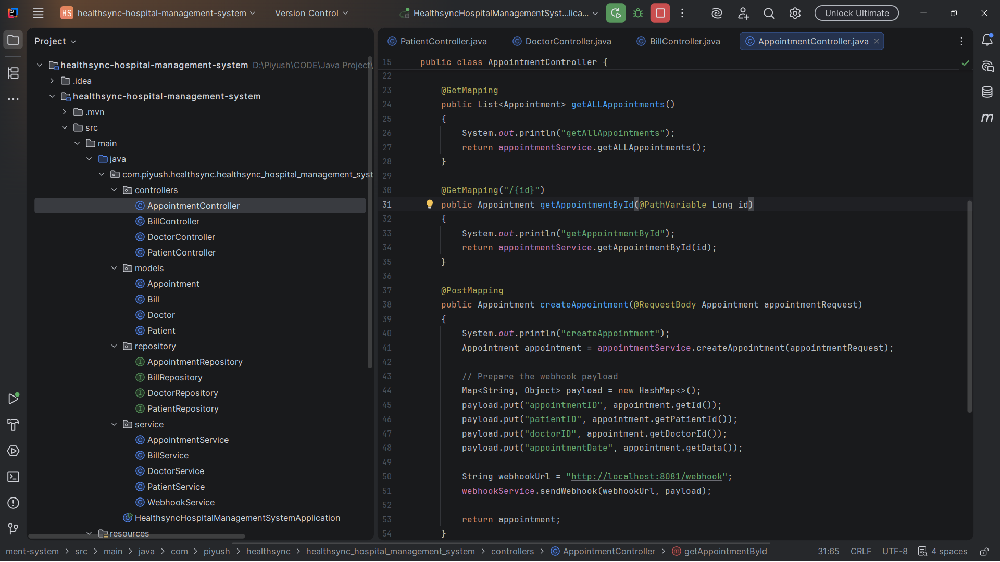
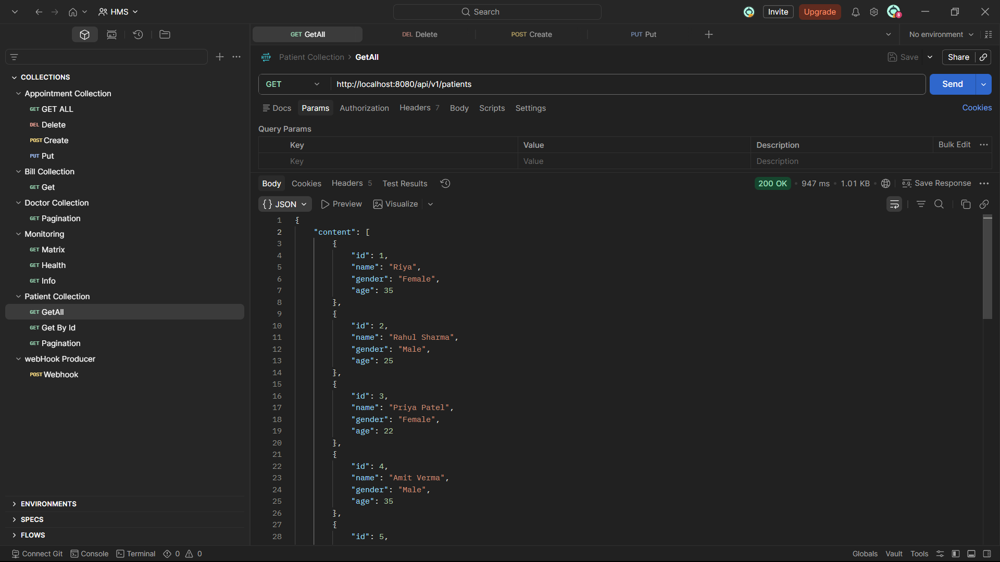
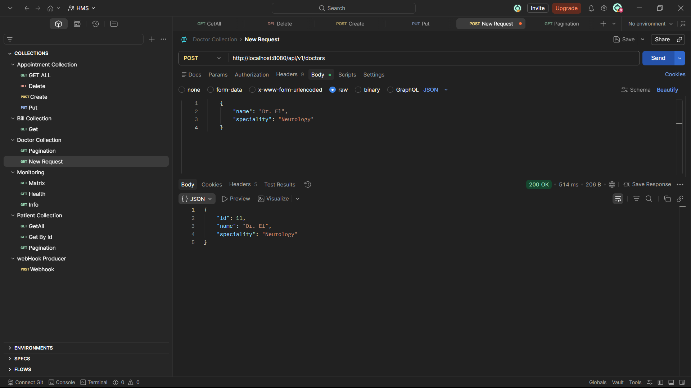
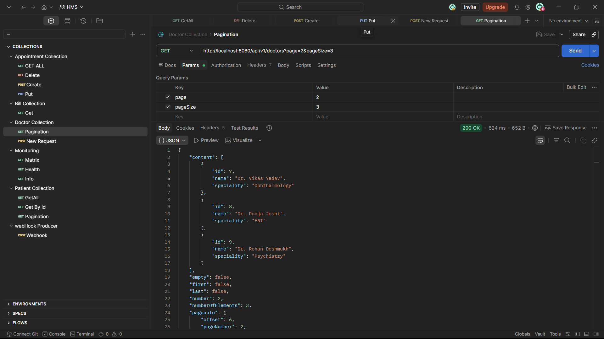
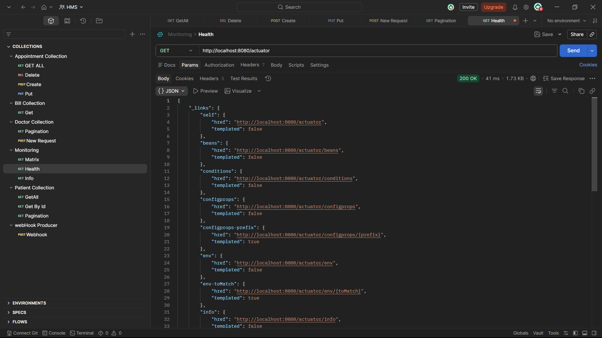
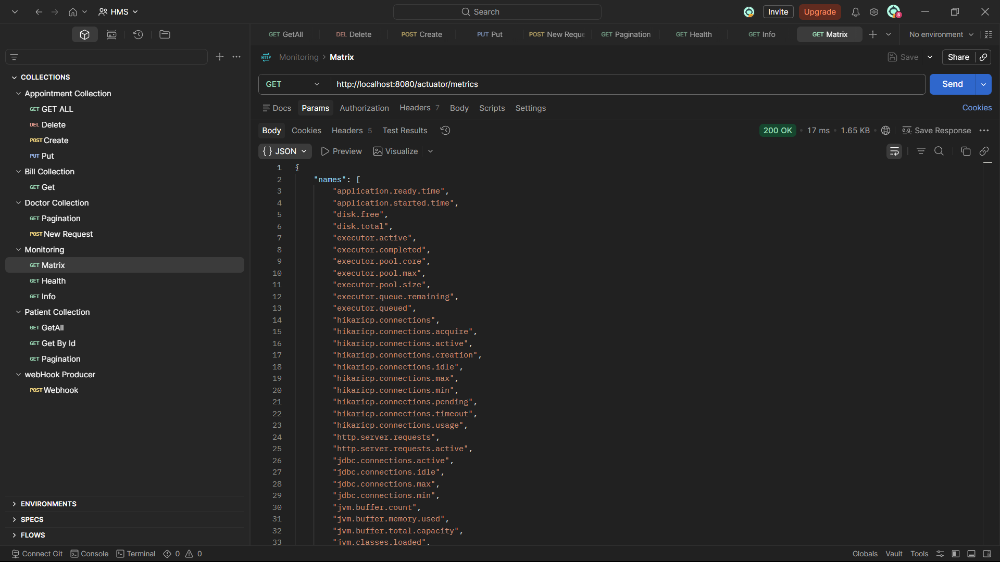
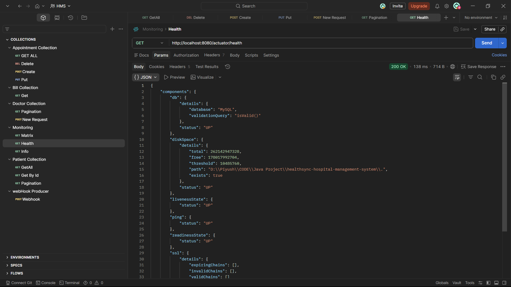
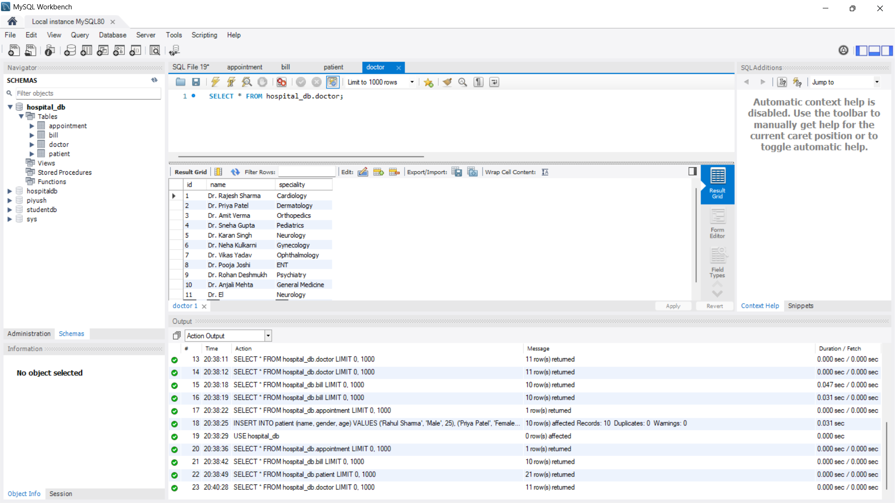
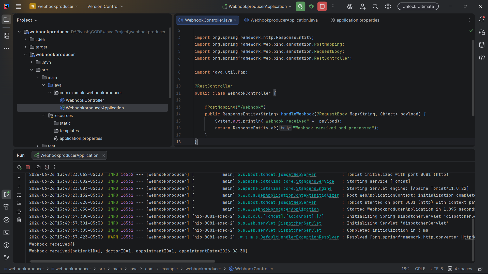

# 🏥 Hospital Management System (Spring Boot)

A backend-focused **Hospital Management System (HMS)** built using **Java, Spring Boot, Spring MVC, Spring Data JPA (Hibernate), and MySQL**. The application exposes RESTful APIs for managing hospital operations such as **Doctors, Patients, Appointments, and Bills**.

The project follows a clean **Layered Architecture** and demonstrates industry-standard backend development practices including REST APIs, pagination, logging, monitoring, request validation, exception handling, webhook integration, and database management.

---

# ✨ Features

## ✅ RESTful API Development

* 👨‍⚕️ Doctor Management
* 🧑 Patient Management
* 📅 Appointment Management
* 💳 Bill Management

## ✅ CRUD Operations

* Create Records
* Retrieve Records
* Update Records
* Delete Records

## ✅ Backend Features

* RESTful API Development
* Layered Architecture (Controller → Service → Repository → Entity)
* Spring Data JPA (Hibernate)
* MySQL Database Integration
* Pagination Support
* Request Validation
* Global Exception Handling
* Log4j2 Logging
* Spring Boot Actuator Monitoring
* Lombok for Boilerplate Reduction
* Webhook Integration (Producer & Consumer)
* Maven Dependency Management

---

# 🛠️ Tech Stack

## Backend

* Java
* Spring Boot
* Spring MVC
* Spring Data JPA (Hibernate)
* MySQL
* Maven
* Lombok
* Log4j2
* Spring Boot Actuator
* REST APIs

---

# 📁 Project Structure

```text
hospital-management-system/
│
├── src/
│   ├── main/
│   │   ├── controller/
│   │   ├── service/
│   │   ├── repository/
│   │   ├── model/
│   │   ├── exception/
│   │   ├── config/
│   │   ├── webhook/
│   │   └── resources/
│   │
│   └── test/
│
├── pom.xml
├── README.md
└── screenshots/
```

---

# 🏛️ Architecture

```text
                    Client (Postman)
                           │
                           ▼
                 Spring Boot Controllers
                           │
                           ▼
                     Service Layer
                           │
                           ▼
                   Repository Layer
                           │
                           ▼
                      MySQL Database

WebhooksProducer (8081) ─────► HMS Application (8080)
```

---

# ⚙️ Installation & Setup

## 1. Clone the Repository

```bash
git clone https://github.com/PiyushGhadle/Hospital-Management-System.git

cd hospital-management-system
```

---

## 2. Configure MySQL

Create a database named:

```sql
CREATE DATABASE hospital_db;
```

---

## 3. Update application.properties

```properties
spring.datasource.url=jdbc:mysql://localhost:3306/hospital_db
spring.datasource.username=root
spring.datasource.password=your_password

spring.jpa.hibernate.ddl-auto=update
```

---

## 4. Run the Application

```bash
mvn spring-boot:run
```

The application starts on:

```text
http://localhost:8080
```

Health Endpoint:

```text
http://localhost:8080/actuator/health
```

---

# 🔗 Webhook Integration

The project demonstrates **webhook-based communication between two Spring Boot applications**.

## Webhook Producer

A separate Spring Boot application named **WebhooksProducer** simulates an external service.

Runs on:

```text
http://localhost:8081
```

Responsibilities:

* Sends HTTP POST webhook requests
* Simulates third-party event notifications
* Triggers webhook events to the Hospital Management System

## Webhook Consumer

The Hospital Management System acts as the webhook consumer.

Responsibilities:

* Receives incoming webhook requests
* Processes webhook payloads
* Demonstrates inter-service communication using REST APIs

### Benefits

* Event-driven communication
* Third-party service integration simulation
* Backend-to-backend communication
* Real-world webhook implementation

---

# 📖 API Documentation

The project exposes RESTful APIs for managing:

- 👨‍⚕️ Doctors
- 🧑 Patients
- 📅 Appointments
- 💳 Bills

The APIs can be tested using **Postman**.

---

# 📡 API Modules

## 👨‍⚕️ Doctors

| Method | Endpoint     | Description      |
| ------ | ------------ | ---------------- |
| GET    | /doctors     | Get all doctors  |
| GET    | /doctor/{id} | Get doctor by ID |
| POST   | /doctor      | Create doctor    |
| PUT    | /doctor/{id} | Update doctor    |
| DELETE | /doctor/{id} | Delete doctor    |

---

## 🧑 Patients

| Method | Endpoint      | Description       |
| ------ | ------------- | ----------------- |
| GET    | /patients     | Get all patients  |
| GET    | /patient/{id} | Get patient by ID |
| POST   | /patient      | Create patient    |
| PUT    | /patient/{id} | Update patient    |
| DELETE | /patient/{id} | Delete patient    |

---

## 📅 Appointments

| Method | Endpoint          | Description           |
| ------ | ----------------- | --------------------- |
| GET    | /appointments     | Get all appointments  |
| GET    | /appointment/{id} | Get appointment by ID |
| POST   | /appointment      | Book appointment      |
| PUT    | /appointment/{id} | Update appointment    |
| DELETE | /appointment/{id} | Cancel appointment    |

---

## 💳 Bills

| Method | Endpoint   | Description    |
| ------ | ---------- | -------------- |
| GET    | /bills     | Get all bills  |
| GET    | /bill/{id} | Get bill by ID |
| POST   | /bill      | Generate bill  |
| PUT    | /bill/{id} | Update bill    |
| DELETE | /bill/{id} | Delete bill    |

---

# 🗄️ Database

* MySQL
* Spring Data JPA (Hibernate)
* Repository Pattern
* Entity Relationships
* Pagination Support

---

# 📊 Monitoring & Logging

### Spring Boot Actuator

* Health Monitoring
* Application Metrics
* Environment Information
* Runtime Monitoring

### Log4j2

* Application Logging
* Error Logging
* Request Tracking
* Debug Logging

---

# 📸 Screenshots

## 🏗️ Project Structure


## 📬 Postman Collection


## 👨‍⚕️ Doctor API


## 📄 Pagination


## 📊 Spring Boot Actuator


## 📈 Actuator Metrics


## ❤️ Actuator Health


## 🗄️ MySQL Database


## 🔗 Webhook Integration


---

# 🚀 Future Improvements

* Spring Security
* JWT Authentication
* Role-Based Authorization (Admin, Doctor, Receptionist)
* DTO Pattern
* MapStruct
* Swagger / OpenAPI Documentation
* Unit Testing (JUnit & Mockito)
* Integration Testing
* Docker & Docker Compose
* Redis Caching
* Search & Filtering
* Sorting
* Email Notifications
* File Upload (Medical Reports)
* GitHub Actions CI/CD
* Cloud Deployment (AWS / Railway / Render)
* API Versioning
* Audit Logging
* Microservices Architecture

---

# 👨‍💻 Author

**Piyush Ghadle**

Java Backend Developer | Spring Boot | MySQL | REST APIs

**GitHub:** https://github.com/PiyushGhadle

---

# ⭐ Support

If you found this project useful, consider giving it a ⭐ on GitHub.
